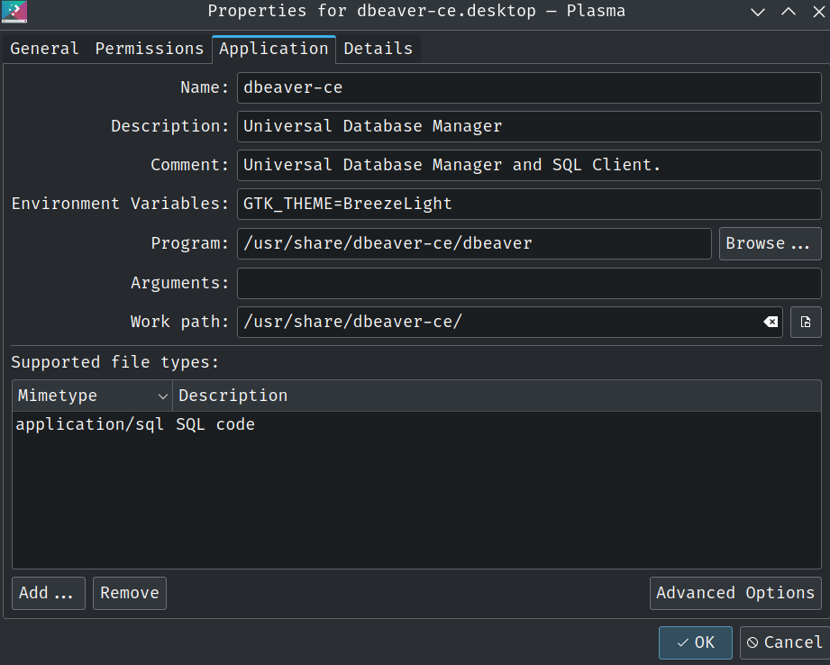

# Gnome based distros

```
cd as root to /usr/share/applications
nano dbeaver-ce.desktop
Add line -> Exec=env GTK_THEME=Adwaita:light /usr/share/dbeaver-ce/dbeaver
Save
```

## KDE Plasma based distros


