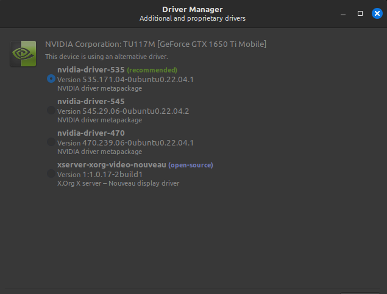

# Git

## Installations:

- Add repo for the latest ubuntu upstream version.
```bash
add-apt-repository ppa:git-core/ppa
sudo apt update
sudo apt install git
```

- When using git for the first time, don't use it from terminal.
- Use vscode built-in terminal to push something on github because vscode has integration to sign in to github and you will be saved from using ssh and other cred management issues.

# Nvidia Drivers
- After installation when booting for the first time, we get a pop-up to install nvidia drivers.
- Please select the recommended proprierity drivers.



# Vscode
- Use deb files.

# Chrome
- Use deb file.